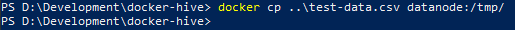
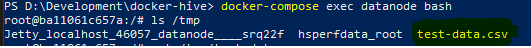

## Exercise One

After completing this exercise you will be proficient in the following tasks:

*   Uploading flat-file data to an edge node
*   Inserting that data into HDFS
*   Creating a Hive database
*   Creating a Hive table for the data
*   Querying the data

For this exercise a data file has been provided with the source files here: documentation\Exercise 1\test-data.csv

<br>

### Step 1 - Uploading Flat File Data
If you still have the terminal shell open from the “Before Getting Started” section, feel free to reuse that.  If not please launch a new terminal window.

You’ll need to know the full path to the source file you wish to inject into the Docker container.  Once you have this, then execute the following command:


```
    docker cp "documentation/Exercise 1/test-data.csv" datanode:/tmp
```


Once the command completes, your file has been injected into the /tmp/ directory on the datanode container
    



Validate that the file has been injected by attaching to the container’s shell and viewing the contents of the /tmp/ directory

```
    docker-compose exec datanode bash
    ls /tmp/
```



<br>

### Step 2 - Adding Flat File to HDFS

If you are still attached to the datanode container’s shell, feel free to reuse that.  If not please attach to that using the following:


```
    docker-compose exec datanode bash
```


Hive already has a warehouse directory configured in HDFS, it is located here:


    /user/hive/warehouse

For the purposes of this exercise we are going to assume that the standard operating procedure for this environment is to contain all database and table sources within the warehouse directory.  However we will need to create sub-directory structures for each database and table.  This can be done with a single command (note the use of the -p switch).


```
    hdfs dfs -mkdir -p /user/hive/warehouse/phe-demo/test-data
```


    

<p id="gdcalert4" ><span style="color: red; font-weight: bold">>>>>>  gd2md-html alert: inline image link here (to images/image4.png). Store image on your image server and adjust path/filename/extension if necessary. </span><br>(<a href="#">Back to top</a>)(<a href="#gdcalert5">Next alert</a>)<br><span style="color: red; font-weight: bold">>>>>> </span></p>


Copy the source file from the /tmp/ directory to the newly created HDFS directory:


```
    hdfs dfs -put /tmp/test-data.csv /user/hive/warehouse/phe-demo/test-data/
```


<p id="gdcalert5" ><span style="color: red; font-weight: bold">>>>>>  gd2md-html alert: inline image link here (to images/image5.png). Store image on your image server and adjust path/filename/extension if necessary. </span><br>(<a href="#">Back to top</a>)(<a href="#gdcalert6">Next alert</a>)<br><span style="color: red; font-weight: bold">>>>>> </span></p>


At this point we have completed our work in the datanode container.  You can now leave its shell prompt by executing the following:


```
    exit
```


### Step 3 - Create Hive Database

You will now need to attach to the hive-server’s shell.  Do this by executing the following in terminal:


```
    docker-compose exec hive-server bash
```


Once at the prompt you will now launch Beeline while attaching to the Hive server by executing the following command:


```
    beeline -u jdbc:hive2://localhost:10000
```


<p id="gdcalert6" ><span style="color: red; font-weight: bold">>>>>>  gd2md-html alert: inline image link here (to images/image6.png). Store image on your image server and adjust path/filename/extension if necessary. </span><br>(<a href="#">Back to top</a>)(<a href="#gdcalert7">Next alert</a>)<br><span style="color: red; font-weight: bold">>>>>> </span></p>


Now at the beeline prompt connected to Hive you can create a new database by executing the following SQL statement:


    _CREATE DATABASE PHEDEMO;_


    

<p id="gdcalert7" ><span style="color: red; font-weight: bold">>>>>>  gd2md-html alert: inline image link here (to images/image7.png). Store image on your image server and adjust path/filename/extension if necessary. </span><br>(<a href="#">Back to top</a>)(<a href="#gdcalert8">Next alert</a>)<br><span style="color: red; font-weight: bold">>>>>> </span></p>


    Confirm the database was created successfully by executing:


    SHOW DATABASES;


    

<p id="gdcalert8" ><span style="color: red; font-weight: bold">>>>>>  gd2md-html alert: inline image link here (to images/image8.png). Store image on your image server and adjust path/filename/extension if necessary. </span><br>(<a href="#">Back to top</a>)(<a href="#gdcalert9">Next alert</a>)<br><span style="color: red; font-weight: bold">>>>>> </span></p>


Without exiting terminal or the beeline prompt proceed to the next step 


### Step 4 - Create Hive Table for Data

For convenience the CREATE TABLE sql statement is stored in the source files located here: “_documentation/Exercise 1/test-data-table.sql.”_  Copy or type the entire statement and then paste it into the terminal so it is executed at the beeline terminal. NOTE: You will see “No rows affected…” when the statement completes.


<p id="gdcalert9" ><span style="color: red; font-weight: bold">>>>>>  gd2md-html alert: inline image link here (to images/image9.png). Store image on your image server and adjust path/filename/extension if necessary. </span><br>(<a href="#">Back to top</a>)(<a href="#gdcalert10">Next alert</a>)<br><span style="color: red; font-weight: bold">>>>>> </span></p>


Verify that the table has been created and that data is now accessible by selecting everything from it:


    SELECT * FROM phedemo.testdata;


<p id="gdcalert10" ><span style="color: red; font-weight: bold">>>>>>  gd2md-html alert: inline image link here (to images/image10.png). Store image on your image server and adjust path/filename/extension if necessary. </span><br>(<a href="#">Back to top</a>)(<a href="#gdcalert11">Next alert</a>)<br><span style="color: red; font-weight: bold">>>>>> </span></p>


You can now execute SQL statements against the table.  When you are finished, execute !q at the beeline prompt.  Then execute exit at the bash shell to leave the hive-server container. 


 > [Go back to Getting Started](../index.md)

 > [Continue on to Exercise 2](pages/exercise_two.md)