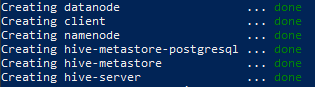

The exercises in this manual assume that you have knowledge of the following technologies and requirements:

*   Docker
*   Git
*   Terminal or Shell access in your machine’s operating system


# Exercises

The exercises in this manual assume that you have knowledge of the following technologies and requirements:

*   Docker
*   Git
*   Terminal or Shell access in your machine’s operating system


## Before Getting Started

After completing this section you should have all required software installed and the PHE repository cloned locally.

**Note**: I will not be going into great detail on how to install the required software, for more help there you will need to refer to their own technical support.  For Linux desktop users, you will need to reference your distribution’s support for Docker installation.  

1. Prepare your OS for Docker
    * Windows
        1. Make sure you are running Windows 10 version 1903 or higher.
        2. Install and configure WSL2: [Click Here](https://docs.microsoft.com/en-us/windows/wsl/install-win10)
        3. Install the [Linux Kernel Update Package](https://docs.microsoft.com/en-us/windows/wsl/install-win10#step-4---download-the-linux-kernel-update-package).
    * macOS:
        1. Mac hardware must be a 2010 or newer model with an Intel Processor.
        2. macOS must be version 10.14 or newer.
2. Download and Install Docker
    * Windows: [Click Here](https://docs.docker.com/docker-for-windows/wsl/)<br>
    * macOS: [Click Here](https://docs.docker.com/docker-for-mac/install/)
3. Download and Install Git
    * Windows: [Click Here](https://git-scm.com/download/win)
    * macOS: [Click Here](https://git-scm.com/download/mac)
4. Git clone the repository
    * From a terminal window (Powershell in Windows, Terminal in macOS) execute the following from a directory you wish to store the source code for the PHE:
    ```
    git clone https://github.com/tbytnar/docker-hive.git
    ```
    * This will automatically download all of the necessary files to your workstation
5. Launch the environments
    * To launch Hadoop only:
        ```
        docker-compose up -d hadoop
        ```
    * To launch Hive (will also launch Hadoop):
        ```
        docker-compose up -d hive
        ```
    * To launch the client only:
        ```
        docker-compose up -d client
        ```
    * To launch Spark only:
        ```
        docker-compose up -d spark
        ```
    * To launch everything:
        ```
        docker-compose up -d
        ```
    3.  When you launch these environments for the first time each of the source images will have to be downloaded.  This process can take anywhere from 5 to 15 minutes depending upon your internet bandwidth.  Once completed you should see an output similar to this: 

        

    **If you experience any errors please refer to the troubleshooting appendix at the end of this document or reach out to the maintainers of this repository.**

<br>

[Continue on to Exercise 1](exercise_one.md)